

  
  

 

  <b>Building autonomous systems at the intersection of AI, markets and crypto.</b>
   
  Independent research &amp; engineering lab — agents that do the research, infrastructure that executes, automation that runs unattended.
   
  Designed, built and operated end to end.

  

  

  
  
  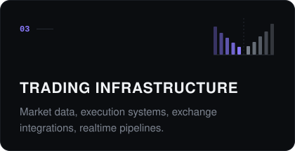
  

  

  
  
  
  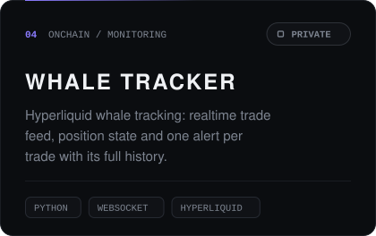
  

  

  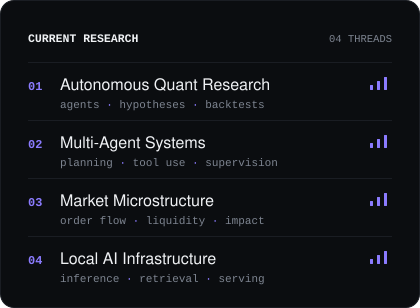
  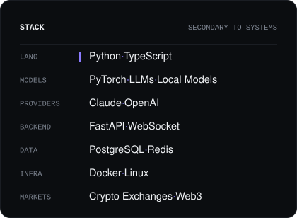

  

  
  
  

  

